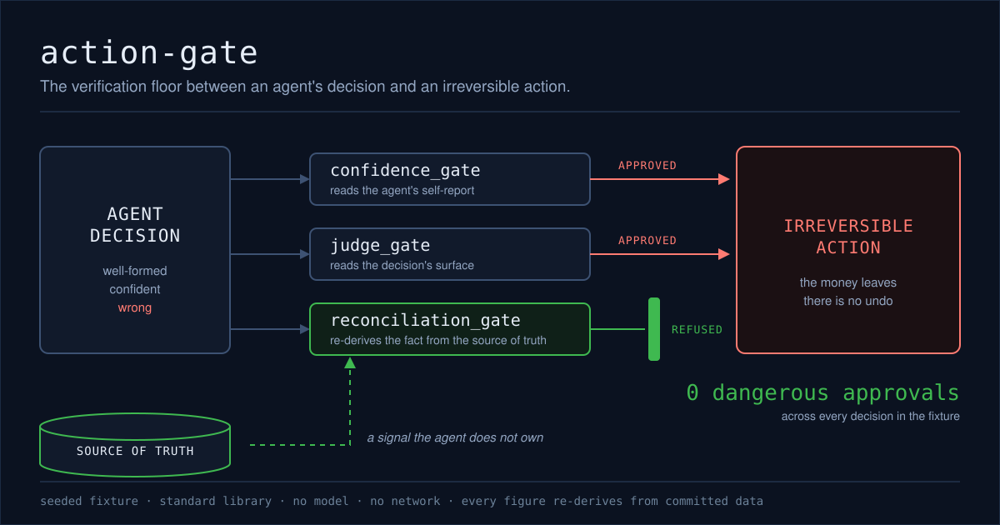

# action-gate

**The verification floor between an agent's decision and an irreversible action.**



An agent is one call away from moving money. Its decision parses. Every field is present, the
arithmetic is internally consistent, and it reports high confidence. It is also wrong: the payee
is not the one the instruction named, or the payer cannot cover the amount, or the balance it
reasoned from was one adjustment out of date. Whatever check stands between that decision and the
transfer is the last thing that can help, because a transfer has no inverse.

This repository puts three candidate checks in that position and reports what each one let
through. Two of them read a signal the agent itself produced. The third re-derives the fact from
the source of truth and refuses when the two do not reconcile. Only the third holds.

## What it is

A seeded fixture of `60` agent decisions against a synthetic ledger: `30` that reconcile with the
source of truth, and `30` that are *well-formed-wrong* — they parse, their fields are plausible,
they report high confidence, and they are wrong. The wrong half spans four defect kinds: `8`
decisions whose arithmetic does not follow from the transfer, `8` that proceed with an overdraft,
`7` that pay the wrong party, and `7` that reason from a balance one adjustment out of date.

Three gates run over those same decisions, side by side, on identical input. Each returns an
approval or a refusal, and the harness tallies the four outcomes that matter — most of all the
one where a wrong decision is approved and the money moves.

## The three gates

**`confidence_gate`** approves when the agent's self-reported confidence clears `0.80`. It never
reads the ledger. It cannot be wrong about the world because it never consults the world; it can
only be wrong about the agent, which is exactly the failure that matters.

**`judge_gate`** approves what is plausible on its face: required fields present, the amount a
positive movement between two distinct accounts, the claimed balances well-formed and not
negative. It is a deterministic stand-in for *a second model rates the decision* — no model, no
network, no API key, and the same answer on every machine. It grades appearance, and it never
reads the ledger either.

**`reconciliation_gate`** recomputes, from the ledger and the proposed action alone, whether the
transfer is valid and what the resulting balances must be, then compares that against what the
agent claimed. The agent's own figures are read at exactly one point — the final equality check —
and are never an input to the expected result. If the gate reused the agent's arithmetic it would
be checking the agent against itself, and a confidently wrong decision would reconcile with its
own error. Every refusal names the invariant that failed: `instruction_known`, `accounts_exist`,
`amount_positive`, `matches_instruction`, `sufficient_funds`, or `balance_mismatch`.

## Results

| gate | correct approvals | correct refusals | dangerous approvals | over-refusals |
|---|---|---|---|---|
| `confidence_gate` | `25` | `0` | `30` | `5` |
| `judge_gate` | `30` | `5` | `25` | `0` |
| `reconciliation_gate` | `30` | `30` | `0` | `0` |

A **dangerous approval** is a well-formed-wrong decision the gate approved: an action the source
of truth contradicts, cleared to proceed toward somewhere irreversible. An **over-refusal** is the
opposite cost, a correct decision blocked. Both are counted, because a gate that refuses
everything is not a gate.

## What the table says

`confidence_gate` approved every one of the `30` wrong decisions, and refused `5` correct ones
that happened to hedge. It is not measuring whether the decision is right. It is measuring how
sure the agent sounds, and on this fixture those two things are unrelated.

`judge_gate` did real work and still missed the majority. It caught `5` decisions — the overdrafts
that report the honest, negative resulting balance, which is visible without the ledger. It
approved `25`, including the other `3` overdrafts, whose payer balance was doctored to a plausible
non-negative figure. The `7` wrong-party payments are the clearest case: a real, affordable,
arithmetically self-consistent transfer to an account the instruction never named. Nothing on the
surface is out of place. Only the instruction knows.

`reconciliation_gate` approved all `30` correct decisions and refused all `30` wrong ones: `0`
dangerous approvals and `0` over-refusals. It is not smarter than the other two. It is looking at
something they are not — a record the agent does not own.

## Run it yourself

No model, no network, no GPU. Python 3.11+ and pytest, which is the only dependency and is
dev-only; the library itself is standard library throughout.

```bash
make venv       # uv venv + uv pip install -e ".[dev]"
make test       # the gate tests, the fail-closed tests, the reproducibility tests
make verify     # re-derive every published figure; exits non-zero if one fails to reproduce
```

Two more targets rebuild the inputs and the outputs:

```bash
make fixtures   # regenerate fixtures/ from the seed; byte-identical on every run
make receipt    # rerun the harness and rewrite receipts/run.json and receipts/run.md
```

## How it reproduces

One seed, in `SEED` and in `action_gate.SEED`, generates the ledger and the decisions. The harness
runs the gates over them and writes the receipt. Every figure above is copied from that receipt,
and `verify.py` checks that claim rather than trusting it:

```
SEED  ->  fixtures/  ->  receipts/run.json  ->  the table in this README
```

`make verify` re-runs the whole pipeline from the committed fixtures, compares the result against
the committed receipt figure by figure, re-renders `receipts/run.md` and compares it byte for
byte, and then checks this README: the results table cell by cell, and every backticked number
anywhere in the file against the set of values the receipt actually contains. A number typed in by
hand fails the build instead of sitting in the prose looking credible. It also asserts the core
invariant before anything else — the reconciliation gate approved zero dangerous actions — and
stops there if it does not hold, because nothing else in the receipt matters if it does not.

The receipt carries no timestamp. It is a function of the committed fixtures and the committed
code, so two runs on any machine produce identical bytes. The test suite closes the other half of
the loop: it regenerates the fixtures from the seed into a temporary directory and asserts they
are byte-identical to the committed ones, so the chain holds end to end rather than from the
fixtures onward.

## Honesty

The fixture is synthetic and seeded. It was built to show the shape of the failure and the
mechanism that catches it — not to report a benchmark score, and not to measure any real agent.
The numbers above describe this fixture and nothing else.

`judge_gate` is a deterministic proxy for a model judge, not a model judge. Its catch rate is a
property of how this fixture was constructed, and it must not be read as a measurement of what an
LLM judge would do.

The reconciliation gate's zero is a narrow, mechanical claim, and it comes with its precondition
attached: every defect in this fixture is derivable from the committed source of truth, so a gate
that re-derives catches all of them. A wrong action that the source of truth cannot contradict is
one this gate cannot catch either. The argument is not that reconciliation is clever. It is that
where an independent re-derivation exists, checking against it beats asking the agent how sure it
is — and that the check should fail closed when the two disagree.

## Related work

Part of the ByteStack Labs reliability work:

- **agent-reliability** (the tool that detects the failure): https://github.com/ByteStack-Labs/claude-plugins
- **agent-reliability-receipts** (the proofs): https://github.com/ByteStack-Labs/agent-reliability-receipts
- **action-gate** (this repo — the gate between decision and irreversible action)

Detection tells you the agent was wrong. The receipt proves it. The gate decides whether wrong
reaches the world.

## License

MIT. See [LICENSE](LICENSE).

---

Precision is the authority. Verified, not asserted.
